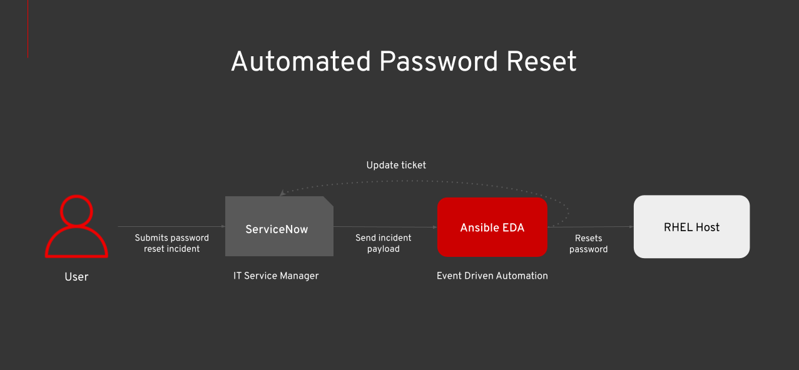
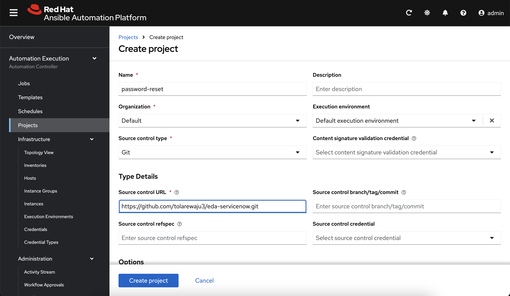
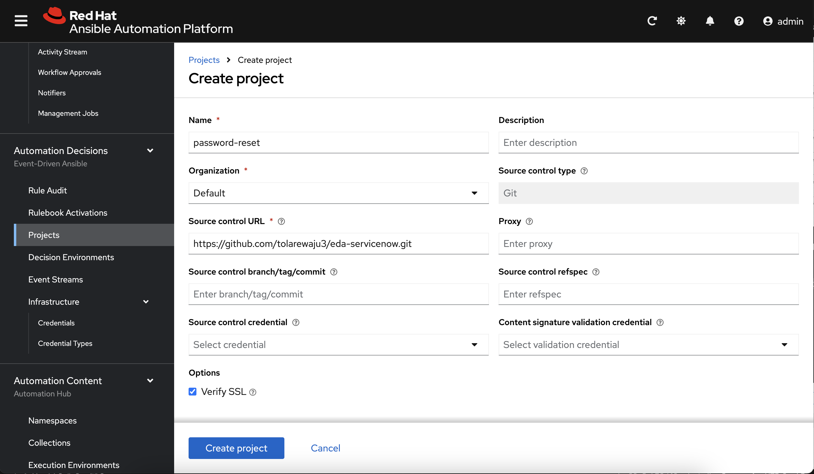
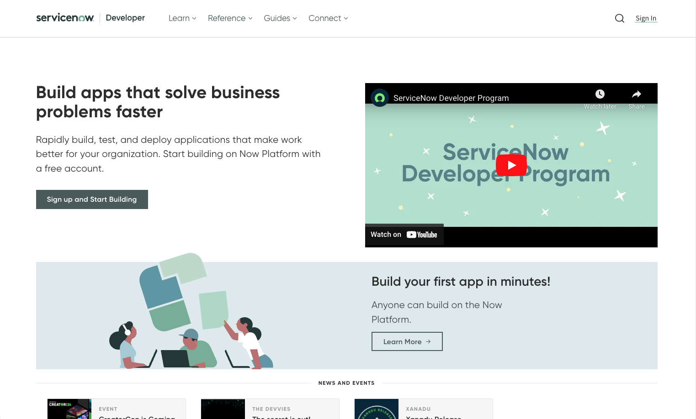
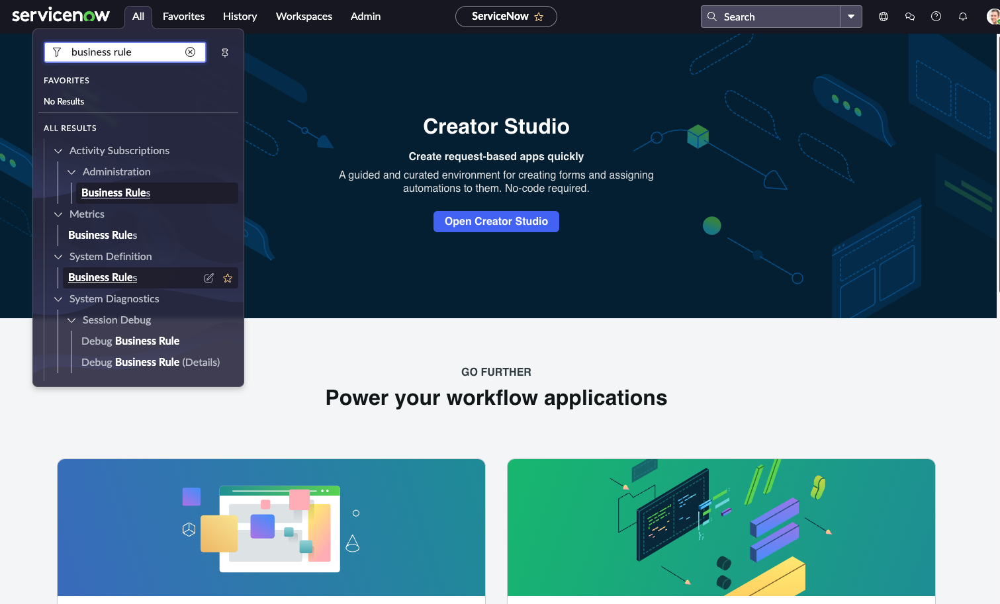

# Autoamted Password Reset (ServiceNow + Ansible)

## The Problem

**40% of IT help desk time go towards password related tasks.** 

A key example of this is resetting employee's forgotten passwords. But while employees wait, productivity stalls, costing money on both ends—IT resolving the issue and employees stuck in limbo. 

**Enter Event-Driven Ansible.** It automates responses to events, like password reset tickets, saving time and money.

## The Architecture

Our archiecture will capture ServiceNow password reset tickets, reset the password on a RHEL host, and notify the user. The architecture has three main parts.

* **SerivceNow** - IT Service management where we'll submit password reset tickets
* **Ansible EDA** - Event Driven Automation to respond to password reset tickets
* **RHEL Host** - Password reset target



## What You'll Need

1. Ansible Automation Platform 2.5
1. Red Hat Enterprise Linux Host (or similar Linux distro)
1. ServiceNow instance (or setup a developer account below)

*AAP needs connectivity to the RHEL Host, and ServiceNow needs connectivity to AAP.*

## Setup Ansible Envrionment

We'll create two things: an job template and a rulebook. 

The job template will run a playbook that resets the password on the RHEL host, while our rulebook will capture ServiceNow events and call the job template.

### Create a Job Template

First, sign in to your ansible instance and select `Automation Execution --> Projects --> Create project`. Use the following details.

* **Name:** password-reset
* **Organization:** Default
* **Execution Environment:** Default execution environment
* **Source control type:** Git
* **Source control URL:** https://github.com/tolarewaju3/eda-servicenow.git

You should see the `Last job status` as Success.



This repository contains a playbook to reset a password on a RHEL host. It's by no means meant for production (as the password is in plain text), but it'll work for us. Here's the playbook.

```yml
---
- name: Reset password on RHEL host
  hosts: all  # Specify your target host group
  become: yes  # Use 'become' if root privileges are needed
  tasks:

    - name: Print Vars
      debug:
        msg: Resetting password for {{ username }}

    - name: Set password for user
      user:
        name: "{{ username }}"
        password: "{{ 'NewSecurePassword123!' | password_hash('sha512') }}"
```

**Create a job template** to run our playbook. In your ansible instance, select `Templates --> Create Template`. Use the following details.

* **Name:** password-reset
* **Job type:** Run
* **Inventory:** Demo inventory (where your RHEL host is)
* **Project:** password-reset
* **Playbook:** playbooks/playbook.yml
* **Execution Environment:** Default execution environment
* **Credentials:** Create credentials for to access your RHEL host
* **Extra vars:** Prompt on launch


### Create a Rulebook Activation

Under the **Automation Decisions** menu, select **Projects** and choose **Create a new project**. Use the following details.

* **Name:** password-reset
* **Organization:** Default
* **Source control URL:** https://github.com/tolarewaju3/eda-servicenow.git

Again, make sure you see the `Status` as Completed.



Next, we'll create an Event Stream. Event Streams are easy ways to capture events from external systems. This is the server-side webhook the ServiceNow will send events to.

**Create an Event Stream token.** Under the **Automation Decisions** menu, in the **Infrastructure** section, select **Credentials** and choose **Create a Credential**. Use the following details.

* **Name:** servicenow-credential
* **Organization:** Default
* **Credential type:** ServiceNow Event Stream
* **Token:** Generate a random token and write it down! We'll use it later

Click Create Credential.


**Next, create the event stream.** Under the **Automation Decisions** menu, select **Event Streams** and choose **Create Event Stream**. Use the following details.

* **Name:** servicenow
* **Organization:** Default
* **Event stream type:** ServiceNow Event Stream
* **Credential:** servicenow-credential

Click **Create event stream**. After it finishes, **copy the webhook url** as we'll use this later in ServiceNow.


**Next, we'll create an AAP credential.** Under the **Automation Decisions** menu, in the **Infrastructure** section, select **Credentials** and choose **Create a Credential**.

* **Name:** aap
* **Organization:** Default
* **Credential type:** Red Hat Ansible Automation Platform
* **Red Hat Ansible Automation Platform:** https://<<your_gateway_host>>/api/controller/
* **Username:** <your_aap_admin_username>
* **Password:** <your_aap_admin_password>


This credential will allow our rulebook to call the password reset job on our Ansible controller. You can find your gateway url in the setting tab.

**Finally, create a rulebook activation.** Under the **Automation Decisions** menu, in the **Rulebook Activations** section, choose **Create Rulebook Activation.** 

* **Name:** password-reset
* **Organization:** Default
* **Project:** password-reset
* **Credential:** aap
* **Rulebook:** servicenow-rulebook.yml
* **Decision Environment:** Default decision environment
* **Event streams:** servicenow

This rulebook will trigger our password reset job based on the ServiceNow event. After it finishes, the Activation status should be `Running`.


## Setup ServiceNow Envrionment

We'll use ServiceNow as our incident management system for password request tickets. If you already have a ServiceNow instance in your environment, you can skip to the "Create a Business Rule" step.

**First, sign up for a ServiceNow developer account.** Navigate to [developer.servicenow.com](https://developer.servicenow.com) and select `Sign Up and Start Building`.



Fill out the relevant information and hit `Sign Up`. Once you're signed in, you should see this screen.


**Request your ServiceNow instance**. In the top right corner, select **Request Instance**. This may take a while, but eventually you should be able open your ServiceNow developer instance.

Next, we'll send events to Ansible each time we open a ticket (or incident). For entierprise instances of ServiceNow, there's an Ansible EDA add-on from the store. But if you're using the developer instance, we'll create a business rule to send events.

**Create a Business Rule**. In your instance, go to the top left and select **All**. Type **Business Rule** into the search bar. Select the one under **System Definition**.



In the top right, select **New** and enter the following:

* **Name:** Send Incident to Ansible EDA
* **Table:** Incident [Incident]
* **Advanced:** Selected
* **When to run:** async
* **Insert:** Selected


**Switch over to the advanced tab** and replace the code with this. Don't forget to insert your own webhook url and token.

```js
(function executeRule(current, previous /*null when async*/) {
    // Webhook URL
    var webhookUrl = '<your_ansible_event_stream_url>';

    var userName = gs.getUser().getName(); // Full name of the user
    var userID = gs.getUser().getID();    // User sys_id
    var userEmail = gs.getUser().getEmail(); // User email address

    // Fetch caller details from the 'caller_id' field
    var caller = current.caller_id.getRefRecord(); // Get the full caller record
    var callerName = caller.getValue('name') || 'Unknown'; // Caller's full name
    var callerEmail = caller.getValue('email') || 'Unknown'; // Caller's email
    var callerID = caller.getUniqueValue(); // Caller's sys_id

    // Payload to send
    var payload = {
        incident_number: current.number.toString(),
        short_description: current.short_description.toString(),
        priority: current.priority.toString(),
        status: current.state.toString(),
        updated_by: current.sys_updated_by.toString(), // User who updated the record
        user: {
            name: userName,
            id: userID,
            email: userEmail
        },
        caller: {
            name: callerName,
            id: callerID,
            email: callerEmail
        }
    };

    // Create the RESTMessageV2 object
    var restMessage = new sn_ws.RESTMessageV2();
    restMessage.setEndpoint(webhookUrl);
	restMessage.setRequestHeader('Authorization', 'Bearer YOUR_TOKEN_HERE');
    restMessage.setHttpMethod('POST');

    // Set request headers
    restMessage.setRequestHeader('Content-Type', 'application/json');

    // Set the request body
    restMessage.setRequestBody(JSON.stringify(payload));

    try {
        // Execute the request
        var response = restMessage.execute();
        var httpStatus = response.getStatusCode();
        var responseBody = response.getBody();

        gs.info('Webhook sent successfully. Status: ' + httpStatus + ', Response: ' + responseBody);
    } catch (ex) {
        gs.error('Error sending webhook: ' + ex.message);
    }
})(current, previous);
```

There's a lot going on here. Here are the important steps.

1. **Build a payload** with variables from our incident (username, userID, incident number)
1. **Create a REST message** with the payload and our authorization headers
1. **Send the REST message** to the Ansible webhook url

Click Submit to create the rule.